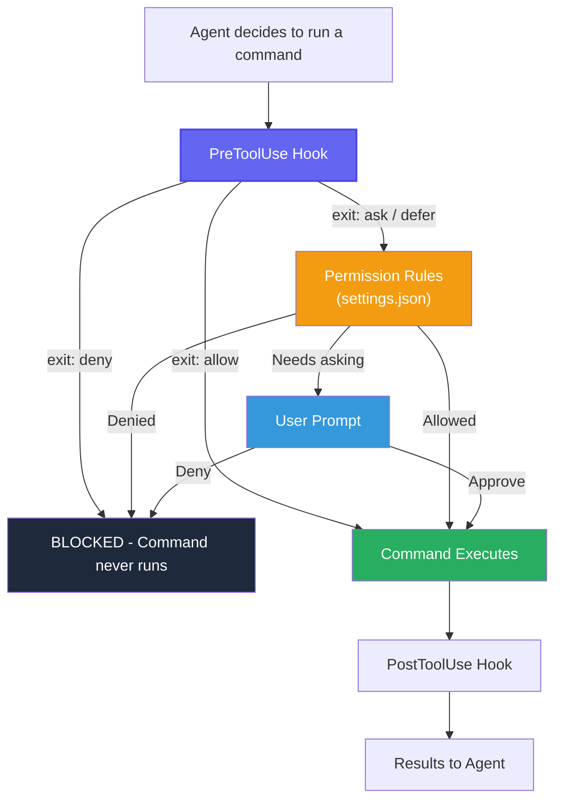

# oc-policy-gate

Namespace-scoped access control for AI coding agents operating on OpenShift/Kubernetes clusters.

| Agent | Status |
|-------|--------|
| Claude Code | Supported |
| Cursor | Coming soon |

A **PreToolUse hook** that intercepts `oc`, `kubectl`, and `helm` commands and enforces verb-level permissions per namespace — before the command ever runs.

## Why

AI agents need cluster access to debug and deploy. Unrestricted access is dangerous — an agent can read secrets, modify resources, or operate in namespaces it shouldn't touch. This hook enforces boundaries without restricting the agent's native tooling.

- **Zero token overhead** — no MCP schemas loaded into context
- **Hard enforcement** — blocks commands even with `--dangerously-skip-permissions`
- **Native tooling** — agents use `oc`/`kubectl`/`helm` directly, no wrappers

## Quick Start

### 1. Copy files into your project

```bash
# Option A: git subtree (recommended — enables pulling updates)
git remote add oc-policy-gate https://github.com/rh-ai-quickstart/oc-policy-gate.git
git subtree add --prefix=.claude/hooks oc-policy-gate master --squash

# Option B: manual copy
mkdir -p .claude/hooks
cp openshift-policy.sh openshift-policy.yaml test-openshift-policy.sh .claude/hooks/
```

### 2. Configure your policy

Edit `.claude/hooks/openshift-policy.yaml` with your namespaces and permissions:

```yaml
namespaces:
  my-app-dev:
    oc: [read, write, exec]
    helm: [read, write]
  my-app-staging:
    oc: [read, write]
    helm: [read]
  my-app-prod:
    oc: [read]
    helm: [read]
```

**Permission groups:**

| Tool | Group | Verbs |
|------|-------|-------|
| oc | `read` | get, describe, logs, events, top, explain, status, diff, wait, auth can-i, rollout status, rollout history |
| oc | `write` | apply, create, patch, delete, scale, label, annotate, set, run, edit, replace, expose, autoscale, rollout restart, rollout undo, rollout pause, rollout resume |
| oc | `exec` | exec, debug, port-forward, cp, attach |
| helm | `read` | template, lint, list, status, get, show, history, search, verify, dependency list, repo list, plugin list |
| helm | `write` | install, upgrade, dependency update, dependency build |
| helm | `destructive` | uninstall, rollback, delete |

### 3. Wire up the hook

Add to your `.claude/settings.json`:

```json
{
  "permissions": {
    "deny": [
      "Read(./.claude/hooks/**)",
      "Edit(./.claude/hooks/**)",
      "Write(./.claude/hooks/**)"
    ]
  },
  "hooks": {
    "PreToolUse": [
      {
        "matcher": "Bash",
        "hooks": [
          {
            "type": "command",
            "if": "Bash(*oc *)",
            "command": "${CLAUDE_PROJECT_DIR}/.claude/hooks/openshift-policy.sh",
            "timeout": 5
          },
          {
            "type": "command",
            "if": "Bash(*kubectl *)",
            "command": "${CLAUDE_PROJECT_DIR}/.claude/hooks/openshift-policy.sh",
            "timeout": 5
          },
          {
            "type": "command",
            "if": "Bash(*helm *)",
            "command": "${CLAUDE_PROJECT_DIR}/.claude/hooks/openshift-policy.sh",
            "timeout": 5
          }
        ]
      }
    ]
  }
}
```

## Pulling Updates (git subtree)

```bash
git subtree pull --prefix=.claude/hooks oc-policy-gate master --squash
```

## How It Works

Every command in Claude Code passes through a gate pipeline:



1. **allow** — command runs without user prompt
2. **deny** — command is blocked (missing namespace, output redirect)
3. **ask** — falls through to Claude Code's normal permission prompt (unknown namespace, unrecognized verb)

**Always denied:** commands without `-n <namespace>`, output redirects (`> file`)

**Auto-allowed (no namespace needed):** `oc version`, `oc whoami`, `helm template`, `helm version`, etc.

## Running Tests

```bash
bash test-openshift-policy.sh
```

39 test cases covering read/write/exec verbs, namespace enforcement, pipes, compound commands, redirects, multi-word verbs, and edge cases.

## Default Namespace (empty policy fallback)

When `openshift-policy.yaml` has no namespaces configured (empty `namespaces:` key or missing file), the hook automatically derives a **deterministic default namespace** from the local environment:

```
opg-{repo-basename, max 30 chars}-{os-username, max 20 chars}
```

The result is lowercased, non-alphanumeric characters are replaced with hyphens, consecutive hyphens are collapsed, and trailing hyphens are stripped. Maximum length is 54 characters (within Kubernetes' 63-char limit).

Example: repo `nvidia-rag-blueprint`, user `jdoe` → namespace `opg-nvidia-rag-blueprint-jdoe`

The derived namespace receives **full permissions** — oc: `read,write,exec`; helm: `read,write,destructive`. Once you add any explicit namespace to the policy YAML, the fallback is disabled entirely.

### Why the agent must not derive the namespace itself

The policy hook exists to **constrain** the agent. If the agent were allowed to read the policy file and compute the default namespace on its own, it would have access to the very configuration that enforces its boundaries — undermining the security model. Instead, the derivation lives inside the hook (which the agent cannot read or modify), and the agent's skill definitions embed a **copy of the same function** so both sides arrive at the same namespace independently.

This separation means:
- The hook computes the namespace to decide **what to allow**
- The skill computes the namespace to decide **what to target**
- Neither side needs to read the other's configuration

### Using the derivation in skills

Embed this function in your skill or subagent prompt so the agent can derive the namespace without accessing the policy files:

```bash
derive_default_ns() {
  local repo_root repo_base user default_ns
  repo_root="$(git rev-parse --show-toplevel 2>/dev/null)" || repo_root="$PWD"
  repo_base="$(basename "$repo_root")"
  user="$(whoami)"
  repo_base="$(echo "${repo_base:0:30}" | tr '[:upper:]' '[:lower:]' | sed 's/[^a-z0-9-]/-/g; s/-\+/-/g; s/-$//')"
  user="$(echo "${user:0:20}" | tr '[:upper:]' '[:lower:]' | sed 's/[^a-z0-9-]/-/g; s/-\+/-/g; s/-$//')"
  default_ns="opg-${repo_base}-${user}"
  echo "$default_ns" | sed 's/-$//'
}
```

The agent runs this function, gets the namespace string, and uses it with `-n` on every `oc`/`helm` command. The hook independently derives the same string and auto-allows the commands — no policy file access needed on either side.

## Customization

Set `OPENSHIFT_POLICY_FILE` environment variable to use a policy file from a different location:

```bash
OPENSHIFT_POLICY_FILE=/path/to/my-policy.yaml
```